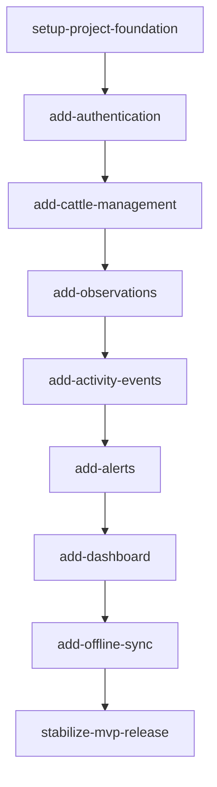

# Project Roadmap

This document summarizes the GyrMonitor MVP roadmap. Detailed phase documents live in `10-roadmap/`.

## MVP Scope

GyrMonitor MVP focuses on:

1. Authentication and roles.
2. Cattle management.
3. Observations.
4. Activity and inactivity events.
5. Risk score and alerts.
6. Dashboard metrics.
7. Offline synchronization for mobile and desktop clients.

## Explicitly Out of Scope

The MVP does not include automated detection pipelines, video processing, model inference, specialized hardware deployment, physical sensors, or external sensing infrastructure.

Structured events may be entered manually, generated by a simulator, or loaded from controlled test data.

## Recommended Implementation Order



## OpenSpec Policy

Each implementation phase should be represented by a manually created OpenSpec change. Proposals, designs and tasks are written and reviewed by the project owner.

## First OpenSpec Proposal

Recommended first proposal:

```text
add-authentication
```

