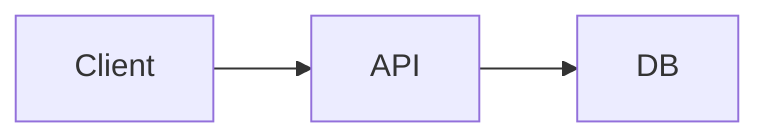

# Style Guide

This guide defines naming, documentation, architecture, API, database, frontend, backend, and Markdown conventions for GyrMonitor.

## General Principles

- Prefer clarity over cleverness.
- Use domain-oriented names.
- Keep business concepts consistent.
- Avoid duplicate terminology.
- Keep documents small and focused.
- Use English for technical documentation and code.
- Use Spanish only for academic DOCX deliverables or explicit university-facing content.

## Language

Use English in:

- Markdown documentation.
- Code.
- API routes.
- DTO names.
- Database identifiers.
- Comments intended for developers.

Keep academic DOCX documents in Spanish.

## Markdown Document Structure

Every major Markdown document should start with frontmatter:

```yaml
---
title: Document Title
module: module-name
version: 0.1.0
status: draft
owner: GyrMonitor Team
last_updated: 2026-06-26
---
```

Recommended structure:

```markdown
# Title

## Purpose

## Scope

## Responsibilities

## Related Requirements

## Related Use Cases

## Related Documents

## Implementation Notes

## Future Improvements

## Change History
```

## Status Values

Use one of:

| Status | Meaning |
| --- | --- |
| draft | Initial version, still under review. |
| accepted | Approved for implementation. |
| deprecated | Kept for history, no longer recommended. |
| superseded | Replaced by another document. |

## Terminology

Use these terms consistently:

| Preferred Term | Avoid |
| --- | --- |
| ActivityEvent | Event, Evento, Activity Event entity |
| RiskScore | Risk score, risk index, índice de riesgo |
| SyncQueue | Sync queue, cola de sincronización |
| Offline First | Offline-first, offline mode only |
| FieldOperator | Encargado, field user |
| Cattle | Bovino, animal, cow |
| Alert | Alert notification, alerta operativa |
| Observation | Inspection note, field note |
| Idempotency-Key | Idempotency key, idempotencyKey header |

Spanish terms may appear in academic explanations, but code and technical docs should use the preferred English terms.

## API Route Conventions

Use plural nouns and kebab-case when needed.

Correct:

```text
GET /api/v1/cattle
POST /api/v1/events
GET /api/v1/alerts
PATCH /api/v1/alerts/{id}/status
POST /api/v1/sync/events
```

Avoid:

```text
/getCattle
/CreateEvent
/update-alert
/api/event/create
```

## JSON Conventions

Use camelCase fields.

Correct:

```json
{
  "cattleId": "uuid",
  "eventType": "INACTIVITY",
  "inactiveMinutes": 95,
  "capturedAt": "2026-06-20T12:30:00Z"
}
```

Avoid:

```json
{
  "cattle_id": "uuid",
  "EventType": "INACTIVITY",
  "inactive_minutes": 95
}
```

## State and Enum Conventions

Use UPPER_SNAKE_CASE for enum values.

Examples:

```text
PENDING
IN_PROGRESS
ATTENDED
LOW
MEDIUM
HIGH
ACTIVE
INACTIVE
INACTIVITY
ACTIVITY
```

## Date and Time Conventions

- Store dates in UTC.
- Use ISO-8601 format.
- Convert to local display time in clients.
- Use `capturedAt` for field capture time.
- Use `createdAt` for server persistence time.
- Use `attendedAt` for alert attendance time.

## Backend Naming

### Use Cases

Use verb + domain object + `UseCase`.

Correct:

```text
LoginUseCase
GetDashboardMetricsUseCase
RegisterActivityEventUseCase
CalculateRiskScoreUseCase
GenerateAlertUseCase
AttendAlertUseCase
AddAlertObservationUseCase
SyncEventsUseCase
SyncObservationsUseCase
```

Avoid:

```text
EventService
RiskManager
AlertHelper
DoSync
```

### DTOs

Use explicit request and response DTO names.

Correct:

```text
RegisterActivityEventRequestDto
RegisterActivityEventResponseDto
UpdateAlertStatusRequestDto
AlertResponseDto
SyncEventsRequestDto
SyncEventsResponseDto
```

Avoid:

```text
EventDto
RequestDto
CreateDto
OutputDto
```

### Repositories

Use interfaces in application/domain boundaries.

Correct:

```text
IActivityEventRepository
IAlertRepository
ICattleRepository
IObservationRepository
ISyncLogRepository
```

Concrete implementations should reveal the technology:

```text
MariaDbActivityEventRepository
MariaDbAlertRepository
```

Avoid:

```text
AlertDAO
AlertDB
DbHelper
```

### Controllers

Use plural domain controller names.

Correct:

```text
AuthController
DashboardController
CattleController
ActivityEventsController
AlertsController
ObservationsController
SyncController
```

## Backend Layer Rules

Controllers must:

- Validate HTTP input.
- Map DTOs to use case input.
- Call use cases.
- Return standardized responses.

Controllers must not:

- Calculate risk scores.
- Generate alerts directly.
- Access the database directly.
- Own business rules.

Use cases must:

- Coordinate business actions.
- Depend on repository interfaces.
- Return application results.
- Be testable without NestJS.

Domain must:

- Contain entities.
- Contain value objects.
- Contain business rules.
- Avoid framework dependencies.

Infrastructure must:

- Implement repositories.
- Configure database access.
- Integrate JWT providers.
- Integrate external services.

## Frontend Naming

### Features

Use feature folders:

```text
features/auth
features/dashboard
features/cattle
features/events
features/alerts
features/metrics
```

### Components

Use PascalCase:

```text
DashboardPage
AlertsTable
RiskRankingCard
AlertSeverityBadge
CattleHistoryTimeline
```

### Hooks

Use `use` prefix:

```text
useDashboardMetrics
useAlerts
useCattleHistory
useLogin
```

### API Clients

Use module-specific clients:

```text
authApi
dashboardApi
cattleApi
eventsApi
alertsApi
syncApi
```

## Frontend Rules

Frontend must:

- Use TanStack Query for remote server state.
- Use local React state for UI-only state.
- Show loading, error, empty, and retry states.
- Protect private routes.
- Map backend errors to user-friendly messages.
- Avoid storing unnecessary sensitive data.

Frontend must not:

- Own risk calculation rules.
- Generate alerts based on local calculations.
- Bypass API contracts.
- Duplicate backend domain logic.

## Database Naming

Use singular table names only if the ORM convention requires it. Otherwise prefer clear plural names consistently.

Recommended central entities:

```text
users
cattle
activity_events
alerts
observations
sync_logs
devices
```

Recommended local entities:

```text
local_alerts
pending_events
pending_observations
sync_queue
```

Use:

- UUID primary keys.
- `created_at`.
- `updated_at` when applicable.
- `captured_at` for event capture time.
- `attended_at` for alert attendance.

## Mermaid Conventions

Use Mermaid for diagrams. Keep diagrams close to the document they explain.

Example:



Use diagrams for:

- C4 context.
- C4 containers.
- Sequence flows.
- Entity relationships.
- Offline sync.
- Domain maps.

## Testing Conventions

Backend tests should cover:

- Use cases.
- Domain rules.
- Repository contracts.
- Controller request/response mapping.

Frontend tests should cover:

- Critical components.
- Authentication flow.
- Dashboard rendering.
- Alert list states.
- API error handling.

## Documentation Change History

Every document should include:

```markdown
## Change History

| Version | Date | Description |
| --- | --- | --- |
| 0.1.0 | 2026-06-26 | Initial version. |
```

## Change History

| Version | Date | Description |
| --- | --- | --- |
| 0.1.0 | 2026-06-26 | Initial style guide. |
