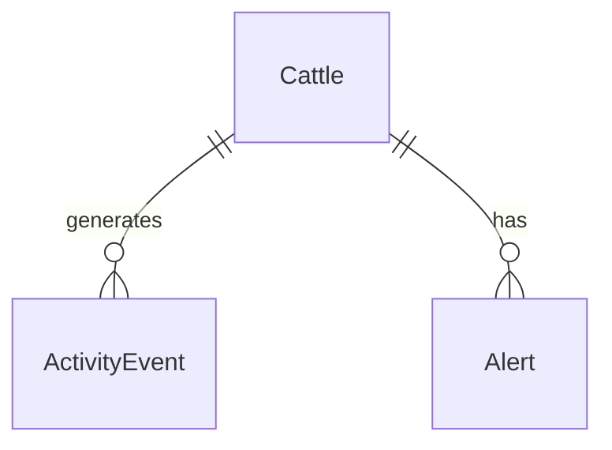

# Cattle

## Purpose

The **Cattle** concept represents an individual Gyr bovine monitored by GyrMonitor. It is the central subject around which activity events, risk scores, alerts, observations, and dashboard metrics are organized.

## Responsibilities

The Cattle domain is responsible for:

- Identifying a monitored animal using a unique tag number.
- Maintaining basic animal information such as breed, sex, birth date, and status.
- Acting as the parent reference for activity events.
- Supporting historical analysis per animal.
- Enabling risk ranking across cattle.

## Entity Definition

| Field | Type | Description |
|---|---|---|
| id | UUID | Unique cattle identifier. |
| tagNumber | string | Human-readable identifier used in the field. |
| breed | string | Breed. For this project, expected value is `Gyr`. |
| sex | string | Animal sex. Suggested values: `MALE`, `FEMALE`. |
| birthDate | date | Optional date of birth. |
| status | string | Operational status. Suggested values: `ACTIVE`, `INACTIVE`. |
| createdAt | datetime | Date when the cattle record was created. |

## Business Rules

| Rule ID | Rule |
|---|---|
| CATTLE-BR-001 | A cattle record must have a unique `tagNumber`. |
| CATTLE-BR-002 | Only active cattle should be considered for alert generation in the MVP. |
| CATTLE-BR-003 | Historical events must remain associated with the original cattle record even if its status changes. |
| CATTLE-BR-004 | The breed field should default to `Gyr` for this MVP scope. |

## Related Requirements

| Requirement | Description |
|---|---|
| RF-01 | Register cattle. |
| RF-02 | Consult cattle. |
| RF-03 | Consult cattle history. |
| RF-17 | Display risk ranking. |
| RN-03 | Centralize historical information. |
| RN-08 | Maintain traceability between event, alert, observation, and user. |

## Related Use Cases

| Use Case | Description |
|---|---|
| CU-01 | Register activity event for an existing cattle record. |
| CU-06 | Consult dashboard metrics related to cattle. |

## Relationships

## Impact Analysis

Changes to the Cattle model may affect:

- Activity event registration.
- Alert generation.
- Dashboard metrics.
- Risk ranking.
- Offline event synchronization.
- Frontend cattle detail views.

## MVP Behavior

In the MVP, cattle records are primarily used as reference data. The system does not attempt to manage veterinary history, full reproductive records, feeding records, or production metrics.

## Future Improvements

- Add corral or location association.
- Add animal photo or visual identity metadata.
- Add health history.
- Add integration with external livestock management systems.

---

## References

- `DOC-01_GyrMonitor_V2_Academico`: master requirements, architecture, offline-first strategy, data models, and C4 diagrams.
- `DOC-03_GyrMonitor_Contratos_Backend_V2_Academico`: REST contracts, DTOs, authentication, synchronization, idempotency, and error model.

## Change History

| Version | Date | Notes |
|---|---:|---|
| 0.1 | 2026-06-26 | Initial domain knowledge-base extraction from academic DOCX sources. |
