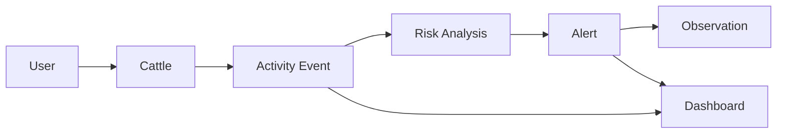

# Domain Model

## Purpose

This document defines the core business concepts of GyrMonitor MVP independent from frameworks, databases or user interfaces.

## Domain Flow

## Core Concepts

| Concept | Description |
| --- | --- |
| Cattle | Registered animal monitored by the system. |
| Activity Event | Structured activity or inactivity record associated with cattle. |
| Risk Analysis | Business process that calculates risk from event data. |
| Alert | Operational signal requiring attention. |
| Observation | Field note registered during inspection or follow-up. |
| Dashboard | Aggregated view of metrics, alerts and trends. |
| Offline Sync | Process that reconciles local operations with the backend. |

## Event Source Independence

The domain does not depend on how an activity event is produced. The MVP supports manual, simulated and controlled test data. Any other source must integrate through the same event contract without changing core business rules.

## Domain Boundary

The MVP domain does not include external detection pipelines, specialized hardware or sensing infrastructure.
