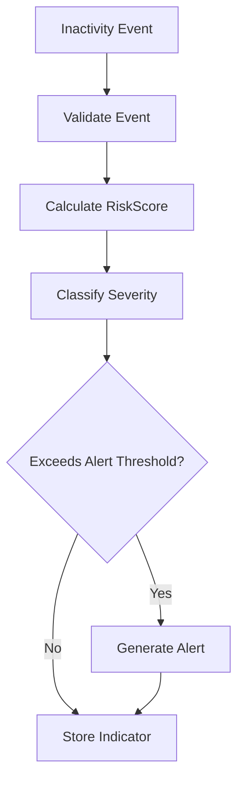

# Risk Analysis

## Purpose

**Risk Analysis** converts inactivity events into a numeric `riskScore` and a qualitative `severity`. It is the bridge between raw behavioral data and operational decision-making.

## Responsibilities

Risk Analysis is responsible for:

- Evaluating inactivity duration.
- Producing a risk score.
- Classifying severity.
- Supporting alert generation decisions.
- Keeping critical business rules in the backend/domain layer rather than in the frontend.

## Main Concepts

| Concept | Description |
|---|---|
| RiskScore | Numeric value used to rank cattle and decide whether an alert should be generated. |
| Severity | Human-friendly classification of risk. Suggested values: `LOW`, `MEDIUM`, `HIGH`. |
| Threshold | Configurable boundary used to determine severity and alert generation. |

## Business Rules

| Rule ID | Rule |
|---|---|
| RISK-BR-001 | Risk calculation applies to `INACTIVITY` events. |
| RISK-BR-002 | The backend is the authoritative source for risk calculation. |
| RISK-BR-003 | The frontend may display risk score but must not calculate critical risk rules. |
| RISK-BR-004 | A high enough risk score must trigger alert evaluation. |
| RISK-BR-005 | Severity must be derived consistently from the risk score or threshold configuration. |

## Suggested MVP Severity Model

This table is a proposed implementation baseline and may be adjusted during validation.

| Severity | Example Condition | Operational Meaning |
|---|---|---|
| LOW | Inactivity detected but below attention threshold. | Monitor only. |
| MEDIUM | Inactivity suggests possible issue. | Review when available. |
| HIGH | Prolonged inactivity exceeds critical threshold. | Prioritize inspection. |

## Related Requirements

| Requirement | Description |
|---|---|
| RF-07 | Calculate risk index. |
| RF-08 | Classify risk level. |
| RF-10 | Generate alerts. |
| RF-15 | Show general metrics. |
| RF-17 | Show risk ranking. |
| RN-01 | Identify prolonged inactivity early. |
| RN-02 | Prioritize field inspections based on risk. |
| RN-10 | Generate useful historical indicators. |

## Related Use Cases

| Use Case | Description |
|---|---|
| CU-02 | Calculate risk. |
| CU-03 | Generate alert. |
| CU-06 | Consult dashboard. |

## Risk Analysis Flow

## Impact Analysis

Changes to risk calculation may affect:

- Alert generation.
- Dashboard metrics.
- Risk ranking.
- Historical trends.
- Research analysis.
- Threshold validation during controlled MVP evaluation.

## MVP Behavior

The MVP should implement a simple, transparent, deterministic rule-based risk calculation. This is preferable to a black-box model during the initial academic validation phase.

## Future Improvements

- Add configurable thresholds by corral, age, sex, or environmental condition.
- Add rolling window analysis.
- Add machine learning-based risk weighting.
- Add veterinary validation feedback loop.

---

## References

- `DOC-01_GyrMonitor_V2_Academico`: master requirements, architecture, offline-first strategy, data models, and C4 diagrams.
- `DOC-03_GyrMonitor_Contratos_Backend_V2_Academico`: REST contracts, DTOs, authentication, synchronization, idempotency, and error model.

## Change History

| Version | Date | Notes |
|---|---:|---|
| 0.1 | 2026-06-26 | Initial domain knowledge-base extraction from academic DOCX sources. |
