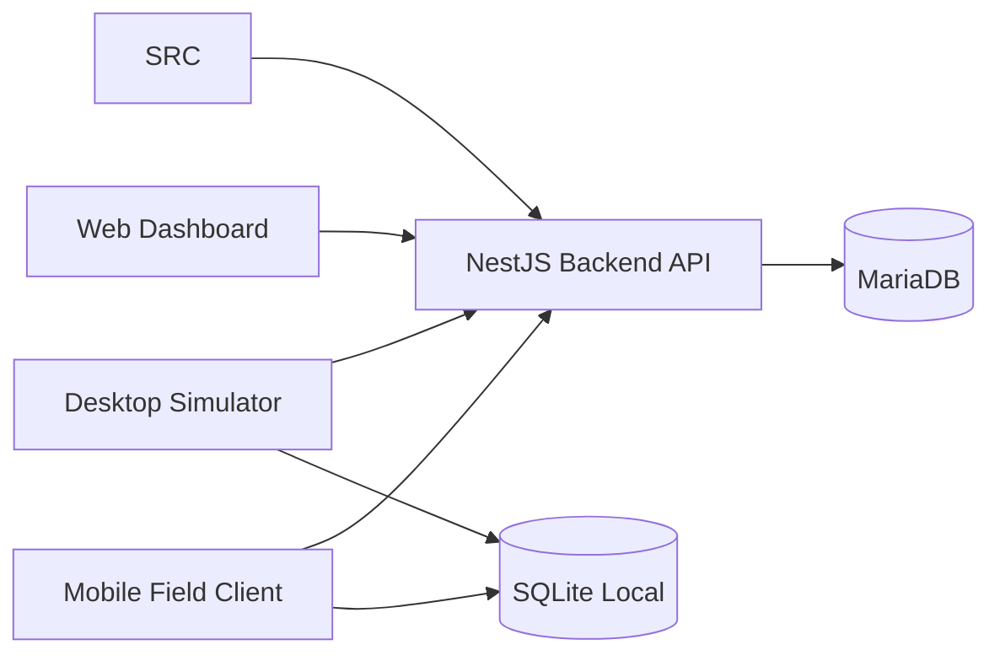

# Architecture Knowledge Base

This folder documents how GyrMonitor MVP is structured as a software system. It translates the academic architecture into development-ready guidance for backend, frontend, mobile, desktop, data storage and synchronization.

## Folder Contents

| Document | Purpose |
|---|---|
| [overview.md](overview.md) | High-level architecture and design principles. |
| [system-context.md](system-context.md) | External actors and system boundaries. |
| [container-architecture.md](container-architecture.md) | Web, mobile, desktop, backend and database containers. |
| [clean-architecture.md](clean-architecture.md) | How Clean Architecture is applied in GyrMonitor. |
| [screaming-architecture.md](screaming-architecture.md) | Domain-first module organization. |
| [offline-first.md](offline-first.md) | Offline behavior for mobile and desktop clients. |
| [sync-architecture.md](sync-architecture.md) | Store-and-forward synchronization, idempotency and conflict handling. |
| [system-design.md](system-design.md) | Capacity assumptions, latency, scalability and system constraints. |
| [scalability.md](scalability.md) | MVP and future scaling paths. |
| [tradeoffs.md](tradeoffs.md) | Key architectural tradeoffs and consequences. |
| [failure-modes.md](failure-modes.md) | Expected failure scenarios and mitigations. |
| [observability.md](observability.md) | Logging, errors, sync traces and operational visibility. |
| [security-architecture.md](security-architecture.md) | JWT, roles, API protection and sensitive data handling. |

## Architecture Principles

GyrMonitor follows these principles:

1. The domain is more important than the framework.
2. The backend centralizes business rules.
3. Mobile and desktop clients must continue working under intermittent connectivity.
4. Data synchronization must be idempotent.
5. The system must remain source-independent for structured activity events.
6. Implementation modules should map directly to business capabilities.

## Main Architecture Flow

## Relationship with Previous Sprints

This architecture is based on:

- `02-domain/`: domain modules and business concepts.
- `03-requirements/`: business, functional and quality requirements.
- Future `06-api/`: endpoint-level API documentation.
- Future OpenSpec changes: proposal and implementation guidance.
