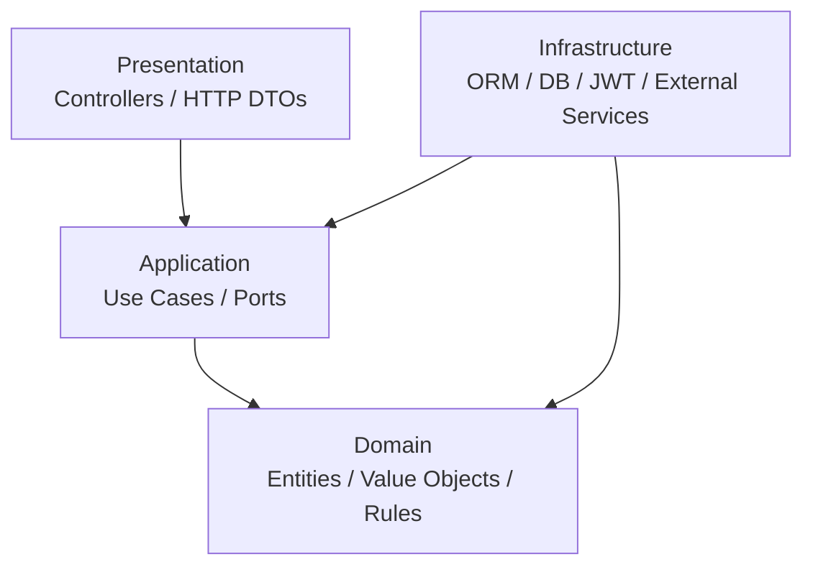

# Clean Architecture

## Purpose

This document explains how GyrMonitor applies Clean Architecture to keep business rules independent from frameworks, databases and transport protocols.

## Layer Model



## Layer Responsibilities

| Layer | Responsibility | Examples |
|---|---|---|
| Domain | Business concepts and invariants. | Cattle, ActivityEvent, Alert, RiskScore. |
| Application | Use cases and ports. | RegisterActivityEventUseCase, SyncEventsUseCase. |
| Presentation | HTTP controllers and DTO mapping. | EventsController, AlertsController. |
| Infrastructure | Database, ORM, JWT and concrete adapters. | MariaDB repositories, JWT service. |

## Dependency Rule

Dependencies point inward toward the domain.

- Domain must not import NestJS, Prisma, MariaDB, HTTP, JWT or React concepts.
- Application may depend on domain and abstract ports.
- Infrastructure implements ports.
- Presentation adapts HTTP requests into application use cases.

## Use Case Examples

| Use Case | Domain Concepts | Infrastructure Dependencies |
|---|---|---|
| RegisterActivityEventUseCase | ActivityEvent, RiskScore, Alert | ActivityEventRepository, AlertRepository. |
| AttendAlertUseCase | Alert, AlertStatus | AlertRepository. |
| AddAlertObservationUseCase | Observation, Alert | ObservationRepository, UserContext. |
| SyncEventsUseCase | ActivityEvent, IdempotencyKey | SyncLogRepository, ActivityEventRepository. |

## Recommended Backend Module Structure

```text
src/
  activity-events/
    domain/
    application/
    infrastructure/
    presentation/
  alerts/
    domain/
    application/
    infrastructure/
    presentation/
  shared/
```

## Benefits

- Easier unit testing of business rules.
- Lower coupling to NestJS and database details.
- Clearer mapping from requirements to implementation.
- Safer future evolution toward queues, time-series storage or additional approved event producers.
