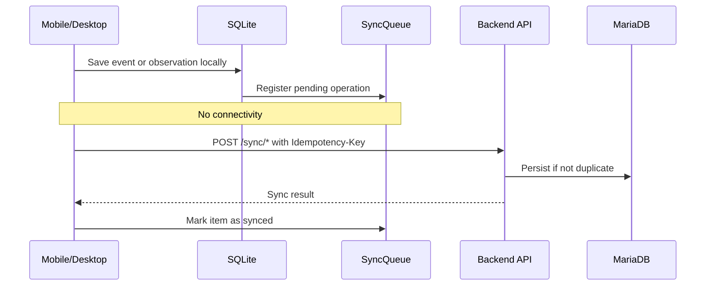

# Offline First Architecture

## Purpose

This document describes how mobile and desktop clients continue operating when internet connectivity is unavailable or unstable.

## Offline Scope

Offline First applies primarily to:

- Mobile field workflows.
- Desktop simulation workflows.
- Observation capture.
- Pending event capture.
- Synchronization after connectivity returns.

The web dashboard may use resilient read cache, but it is not the main offline client in the MVP.

## Local Persistence

Mobile and desktop clients use SQLite to persist:

- Local alerts.
- Pending activity events.
- Pending observations.
- Sync Queue items.
- Retry metadata.

## Offline Flow

## Offline Data States

| State | Meaning |
|---|---|
| PENDING | Stored locally and waiting for sync. |
| SYNCING | Currently being sent to backend. |
| SYNCED | Accepted by backend. |
| FAILED | Sync failed and may be retried. |
| CONFLICT | Server rejected operation due to conflict. |

## User Experience Requirements

The client must clearly indicate when:

- The user is offline.
- Data was saved locally.
- Synchronization is pending.
- Synchronization failed.
- Data may be stale.

## Business Rule

Offline availability must not create duplicate server records. Every retryable operation must be idempotent or uniquely identifiable.

## MVP Constraints

The MVP does not require full offline editing of every entity. Offline behavior is focused on field-critical operations.
