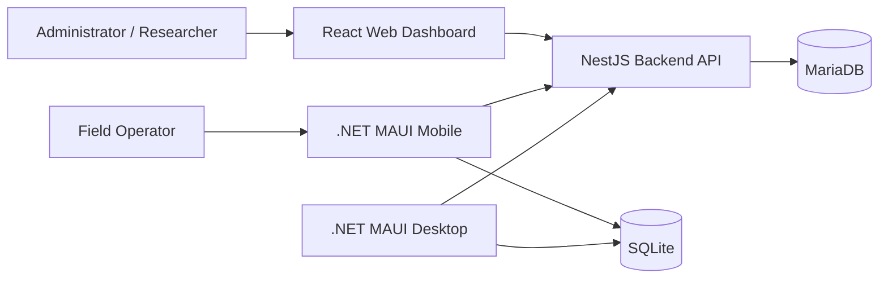

# Architecture Overview

## Purpose

This document describes the high-level architecture of GyrMonitor, a platform for monitoring prolonged inactivity in Gyr cattle under intermittent connectivity conditions.

## Architectural Style

GyrMonitor uses a **modular monolith** for the MVP, with internal boundaries organized around domain capabilities.

The selected architecture combines:

- Clean Architecture.
- Screaming Architecture.
- Offline First client behavior.
- REST API contracts.
- Eventual synchronization.
- Centralized business rules.

## High-Level View

## Core Design Decisions

| Decision | Selected Option | Rationale |
|---|---|---|
| Backend style | Modular monolith | Lower MVP complexity with strong internal modularity. |
| API style | REST | Simple and compatible with web, mobile, desktop and web, mobile and desktop clients. |
| Data consistency | Eventual consistency for offline clients | Rural connectivity requires availability over immediate consistency. |
| Central database | MariaDB | Relational domain with traceability requirements. |
| Local storage | SQLite | Reliable embedded storage for mobile and desktop clients. |
| Frontend rendering | CSR | Private interactive dashboard with no SEO requirement. |

## Architecture Goals

- Preserve traceability between activity events, risk analysis, alerts, observations and users.
- Support offline work for field users.
- Avoid duplicate events during retry-based synchronization.
- Keep risk and alert rules in the backend.
- Keep the system ready for future external event-source input sources.

## Architecture Boundaries

The MVP excludes production machine learning, real sensors, IoT integrations and automatic veterinary diagnosis. The architecture still prepares stable integration points for those future capabilities.

## References

- `02-domain/domain-model.md`
- `03-requirements/quality-attributes.md`
- `04-architecture/clean-architecture.md`
- `04-architecture/offline-first.md`
