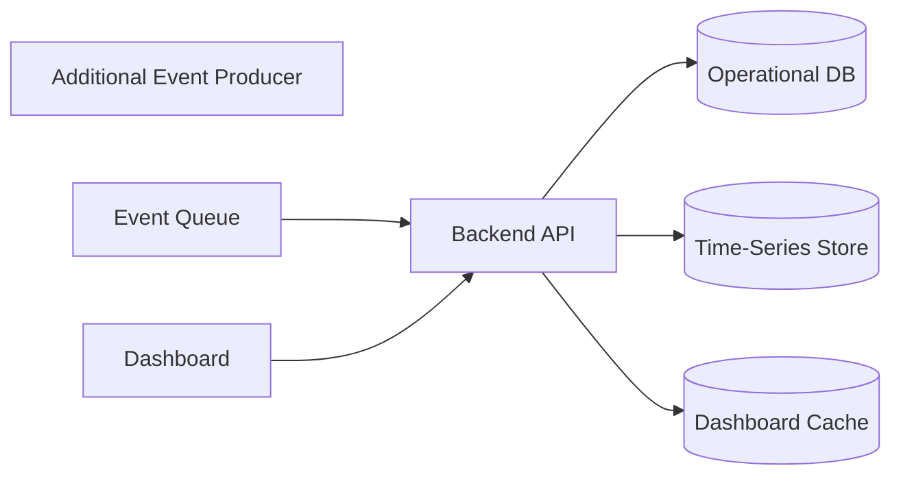

# Scalability

## Purpose

This document defines how GyrMonitor can evolve from MVP to higher-volume deployments.

## MVP Strategy

The MVP uses:

- Modular monolith backend.
- MariaDB central database.
- REST API.
- SQLite for offline clients.
- Direct dashboard queries.

This is intentionally simple and appropriate for the academic MVP.

## Evolution Path

| Stage | Capability | Architecture Change |
|---|---|---|
| V1 MVP | 100 cattle, simulated/manual events | Modular monolith + MariaDB. |
| V2 | Faster dashboard and more users | Cache dashboard metrics and add read optimization. |
| V3 | Higher event frequency | Introduce message queue for event ingestion. |
| V4 | Large telemetry history | Add time-series storage or analytical tables. |
| V5 | Advanced ingestion | Add queue-based ingestion and specialized storage if volume requires it. |

## Scaling Bottlenecks

| Bottleneck | Risk | Mitigation |
|---|---|---|
| Dashboard aggregation | Slow queries under large event volume. | Precomputed metrics, caching, read models. |
| Event ingestion | High write rate from additional sources. | Queue-based ingestion. |
| Sync batches | Large offline backlog after outages. | Batch size limits, retry policy, backoff. |
| Single database | Read/write pressure. | Indexing, replicas, data partitioning. |

## Recommended Database Indexes

Future implementation should consider indexes for:

- `ActivityEvent.cattleId`
- `ActivityEvent.capturedAt`
- `Alert.status`
- `Alert.severity`
- `Alert.cattleId`
- `Observation.alertId`
- `SyncLog.deviceId`

## Future Architecture

## Scalability Principle

Do not introduce distributed complexity before the MVP proves the workflow. Keep clear module boundaries so future extraction is possible if needed.
