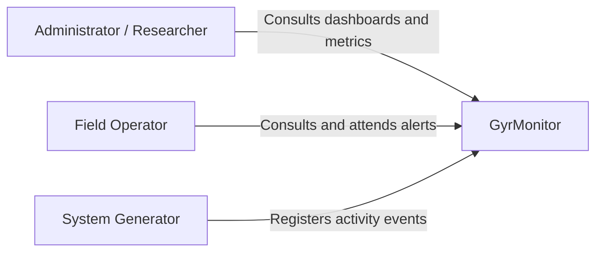

# System Context

## Purpose

This document defines the boundary between GyrMonitor and external actors or systems.

## Primary Actors

| Actor | Description | Main Interactions |
|---|---|---|
| Administrator | User responsible for monitoring the global system state. | Dashboard, cattle records, alerts, metrics. |
| Researcher | User interested in historical behavior and trends. | Trends, rankings, event history. |
| Field Operator | User responsible for inspecting cattle and recording observations. | Mobile alerts, observations, alert attendance. |
| System Generator | Logical source of activity/inactivity events, such as simulator, desktop client, or controlled test data. | Event registration. |

## Context Diagram

## System Boundary

GyrMonitor includes:

- Web dashboard.
- Mobile client.
- Desktop client and simulator.
- Backend API.
- Central database.
- Local offline storage.
- Synchronization workflow.

GyrMonitor does not include in the MVP:

- Veterinary diagnosis automation.
- IoT device fleet management.
- Real-time notification service.

## External Integration Points

| Integration | MVP Status | Future Role |
|---|---|---|
| Notification Service | Not implemented | Push/SMS/email alerts. |
| Time-series Store | Not implemented | High-volume event analytics. |

## Context Risks

- Connectivity loss may delay central visibility.
- Simulated or manually entered event quality affects alert reliability.
- Additional approved event producers may increase event volume.
- Field observations depend on human follow-up.
