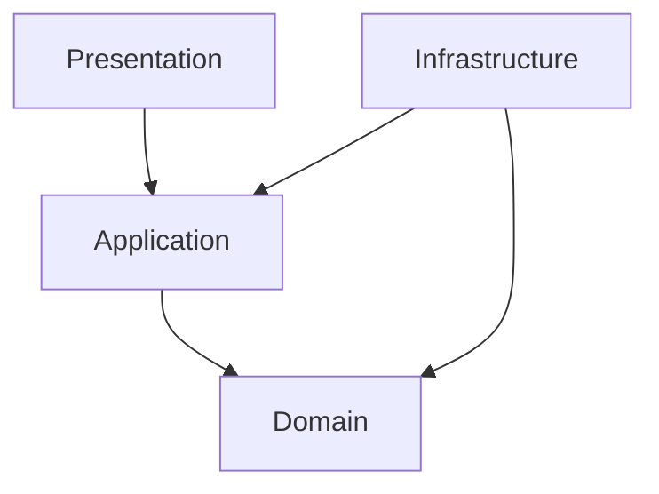

# Backend Clean Architecture Layout

The backend follows Clean Architecture to protect business logic from framework and database details.

## Folder Convention

```text
module-name/
  domain/
  application/
  infrastructure/
  presentation/
```

## Dependency Rule



Outer layers may depend on inner layers. Inner layers must not depend on outer layers.

## Practical Example

`RegisterActivityEventUseCase` may depend on:

- `IActivityEventRepository`
- `ICattleRepository`
- `IRiskCalculator`
- `IAlertRepository`

It must not depend on:

- Prisma client directly
- NestJS request objects
- HTTP response objects
- SQL query builders

## Testing Strategy

Use cases should be tested with fake repositories. Infrastructure repositories should be tested separately against a test database or controlled integration environment.
