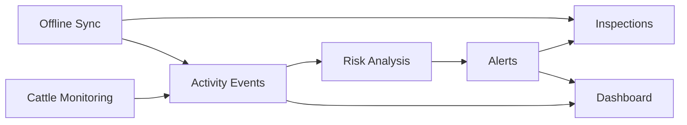

# Backend Modules

Backend modules are organized by business capability, not by technical layer alone.

## Modules

| Module | Responsibility |
|---|---|
| `authentication` | Login, JWT validation, roles |
| `cattle-monitoring` | Cattle registration, listing and history |
| `activity-events` | Activity and inactivity event registration |
| `risk-analysis` | Risk score and severity classification |
| `alerts` | Alert creation, listing and status changes |
| `inspections` | Observations and field inspection records |
| `dashboard` | Aggregated metrics and risk ranking |
| `offline-sync` | Store-and-forward synchronization from offline clients |
| `shared` | Cross-cutting primitives and utilities |

## Module Interaction

## Rule

Avoid creating generic modules such as `common-business` or `services`. Shared code should be limited to primitives that have no business ownership.
