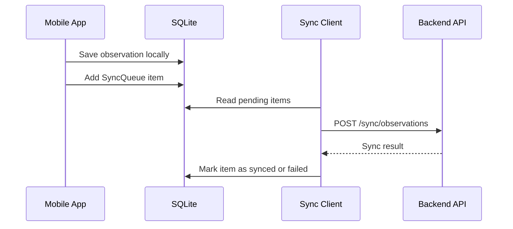

# Mobile Sync Client

The sync client processes pending local operations and sends them to the backend using sync endpoints.

## Flow

## Idempotency

Every sync request must include a stable `Idempotency-Key` so retries do not create duplicate server records.
