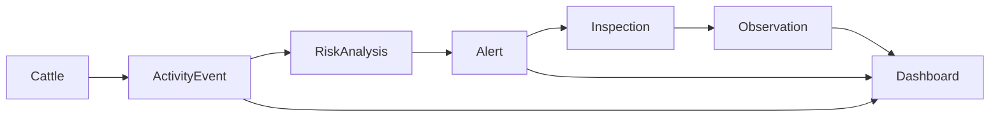

# Quick Reference

## Core Flow



## Main Modules

| Module | Purpose | Primary Documents |
|---|---|---|
| Authentication | User and system access control. | `05-api/authentication.md`, `06-engineering/backend/overview.md` |
| Cattle | Gyr cattle registry and identity. | `02-domain/cattle.md`, `05-api/cattle.md` |
| Activity Events | Activity/inactivity event intake. | `02-domain/activity-events.md`, `05-api/activity-events.md` |
| Risk Analysis | Risk score and severity classification. | `02-domain/risk-analysis.md` |
| Alerts | Operational warnings derived from risk. | `02-domain/alerts.md`, `05-api/alerts.md` |
| Observations | Field notes associated with alerts. | `02-domain/observations.md`, `05-api/observations.md` |
| Offline Sync | Store-and-forward synchronization. | `02-domain/offline-sync.md`, `05-api/offline-sync.md` |
| Dashboard | Metrics, ranking and trends. | `05-api/dashboard.md` |

## Main Endpoints

| Capability | Method | Endpoint | Notes |
|---|---:|---|---|
| Login | POST | `/api/v1/auth/login` | Public. Returns JWT. |
| Dashboard | GET | `/api/v1/dashboard` | ADMIN, RESEARCHER. |
| List cattle | GET | `/api/v1/cattle` | ADMIN, RESEARCHER. |
| Cattle event history | GET | `/api/v1/cattle/{id}/events` | ADMIN, RESEARCHER. |
| Register event | POST | `/api/v1/events` | SYSTEM_GENERATOR, ADMIN. |
| List alerts | GET | `/api/v1/alerts` | ADMIN, FIELD_OPERATOR, RESEARCHER. |
| Alert detail | GET | `/api/v1/alerts/{id}` | Protected. |
| Update alert status | PATCH | `/api/v1/alerts/{id}/status` | FIELD_OPERATOR, ADMIN. |
| Add observation | POST | `/api/v1/alerts/{id}/observations` | FIELD_OPERATOR, ADMIN. |
| Sync events | POST | `/api/v1/sync/events` | Requires `Idempotency-Key`. |
| Sync observations | POST | `/api/v1/sync/observations` | Requires `Idempotency-Key`. |
| Sync status | GET | `/api/v1/sync/status` | Protected. |

## Canonical Roles

| Role | Description |
|---|---|
| `ADMIN` | Full operational access for administration. |
| `FIELD_OPERATOR` | Field alert review, observations and sync. |
| `RESEARCHER` | Dashboard, trends and historical analysis. |
| `SYSTEM_GENERATOR` | Event ingestion from simulator, desktop client or controlled test data. |

## Canonical Enums

```text
AlertStatus: PENDING | IN_PROGRESS | ATTENDED
Severity: LOW | MEDIUM | HIGH
EventType: ACTIVITY | INACTIVITY
SyncStatus: PENDING | SYNCED | FAILED | CONFLICT
Sex: MALE | FEMALE
CattleStatus: ACTIVE | INACTIVE | UNDER_OBSERVATION
```

## Standard Response Envelope

```json
{
  "success": true,
  "data": {},
  "meta": {
    "requestId": "req-123",
    "timestamp": "2026-06-20T12:00:00Z"
  }
}
```

## Standard Error Envelope

```json
{
  "success": false,
  "error": {
    "code": "VALIDATION_ERROR",
    "message": "The request contains invalid fields.",
    "details": [
      { "field": "cattleId", "message": "cattleId is required" }
    ]
  },
  "meta": {
    "requestId": "req-123",
    "timestamp": "2026-06-20T12:00:00Z"
  }
}
```

## Implementation Order Recommendation

1. Authentication.
2. Cattle Monitoring.
3. Activity Events.
4. Risk Analysis.
5. Alerts.
6. Observations.
7. Dashboard.
8. Offline Sync.
9. Frontend Dashboard.
10. Mobile/Desktop offline clients.
