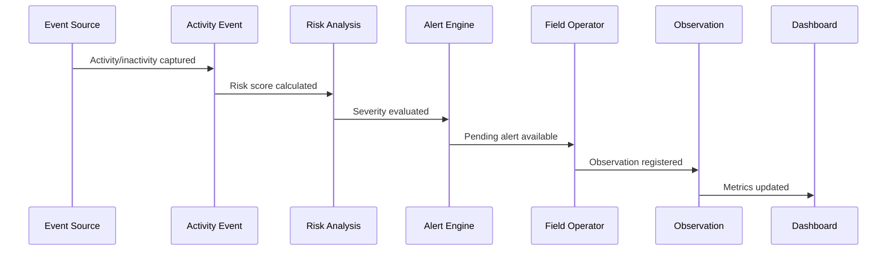

# Business Events

Business events describe meaningful state changes in the domain. They are not necessarily implemented as distributed events in the MVP.

## Event Flow

## Catalog

| Business Event | Trigger | Produced By | Consumed By |
|---|---|---|---|
| `ActivityEventRegistered` | Activity or inactivity event is accepted. | Inactivity Analysis | Risk Analysis, Dashboard |
| `RiskScoreCalculated` | Risk score is computed. | Risk Analysis | Alert Engine, Dashboard |
| `AlertGenerated` | Risk exceeds alert threshold. | Alerts | Field Operator UI, Dashboard |
| `AlertStatusChanged` | Alert status changes. | Alerts | Dashboard, Audit/Sync logs |
| `ObservationCreated` | Field note is recorded. | Inspections | Dashboard, Alert Detail |
| `SyncItemProcessed` | Offline item is synchronized. | Offline Sync | Sync logs, clients |

## MVP Rule

For the MVP, these events may be implemented as application-layer method calls and database records, not as asynchronous message broker events.

## Future Evolution

In later versions, high-volume events may be moved to an event queue or streaming pipeline.
