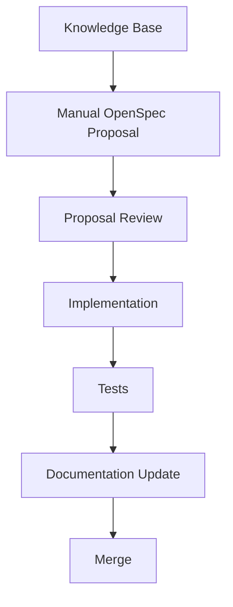

# Developer Guide

## Development Principle

Documentation comes before implementation.

The expected flow is:

## Before Coding

1. Identify the domain module.
2. Read the related domain document.
3. Read related requirements and business rules.
4. Read API contracts if the change touches integration.
5. Read engineering conventions.
6. Create or review the OpenSpec proposal manually.

## During Coding

- Keep domain rules out of controllers and UI components.
- Keep use cases focused on one application operation.
- Keep DTOs aligned with the API reference.
- Keep naming aligned with `07-reference/naming-conventions.md`.

## After Coding

- Run tests.
- Update docs when behavior changes.
- Update examples when API payloads change.
- Update ADRs only when architectural decisions change.
