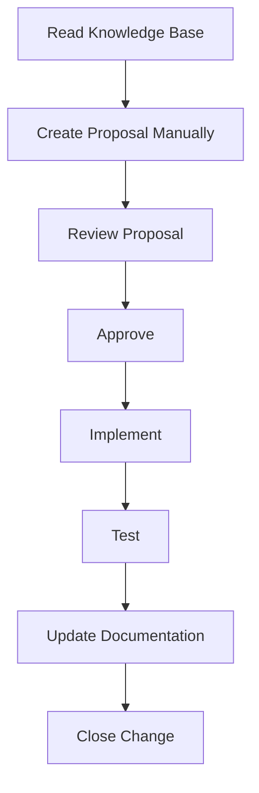

# OpenSpec Workflow for GyrMonitor

## Recommended Flow

1. Choose a small capability.
2. Read the related Knowledge Base files.
3. Write the OpenSpec proposal manually.
4. Review scope, risks and dependencies.
5. Implement only after approval.
6. Run tests.
7. Update documentation if behavior changed.
