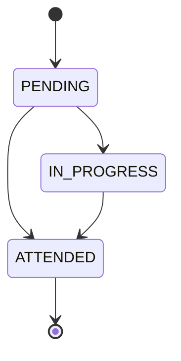
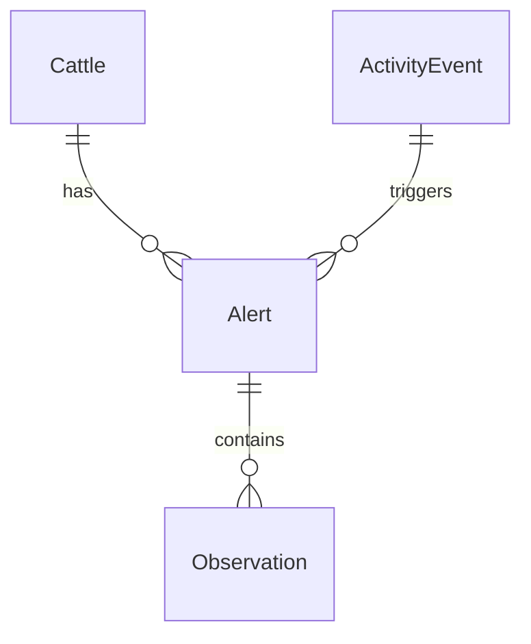

# Alerts

## Purpose

An **Alert** represents an operational warning generated when inactivity analysis indicates that a cattle record may require attention. Alerts are the main mechanism used to prioritize field inspections.

## Responsibilities

The Alerts domain is responsible for:

- Creating alerts from risk analysis results.
- Maintaining alert severity.
- Maintaining alert status.
- Supporting field operator workflows.
- Linking the alert to cattle, origin event, observations, and user actions.
- Supporting dashboards and rankings.

## Entity Definition

| Field      | Type     | Description                             |
| ---------- | -------- | --------------------------------------- |
| id         | UUID     | Alert identifier.                       |
| cattleId   | UUID     | Related cattle.                         |
| eventId    | UUID     | Origin activity event.                  |
| severity   | string   | `LOW`, `MEDIUM`, or `HIGH`.             |
| riskScore  | decimal  | Numeric score that motivated the alert. |
| status     | string   | `PENDING`, `IN_PROGRESS`, `ATTENDED`.   |
| reason     | string   | Human-readable alert reason.            |
| createdAt  | datetime | Alert creation timestamp.               |
| attendedAt | datetime | Timestamp when alert was attended.      |

## Status Lifecycle

## Business Rules

| Rule ID      | Rule                                                                             |
| ------------ | -------------------------------------------------------------------------------- |
| ALERT-BR-001 | New alerts start with status `PENDING`.                                          |
| ALERT-BR-002 | Alerts must reference a cattle record.                                           |
| ALERT-BR-003 | Alerts generated from inactivity must reference the origin event when available. |
| ALERT-BR-004 | Severity must be consistent with the calculated risk score.                      |
| ALERT-BR-005 | An attended alert must record `attendedAt`.                                      |
| ALERT-BR-006 | Alerts should be filterable by status, severity, cattle, and period.             |
| ALERT-BR-007 | Alerts should preserve traceability to observations and users.                   |

## Related Requirements

| Requirement | Description                                                        |
| ----------- | ------------------------------------------------------------------ |
| RF-10       | Generate alerts.                                                   |
| RF-11       | Consult alerts.                                                    |
| RF-12       | Modify alert status.                                               |
| RF-13       | Register observations.                                             |
| RF-15       | Show general metrics.                                              |
| RF-17       | Show risk ranking.                                                 |
| RN-02       | Prioritize field inspections based on risk.                        |
| RN-08       | Maintain traceability between event, alert, observation, and user. |

## Related Use Cases

| Use Case | Description           |
| -------- | --------------------- |
| CU-03    | Generate alert.       |
| CU-04    | Register observation. |
| CU-06    | Consult dashboard.    |

## Relationships

## Operational View

A field operator should be able to:

- See pending alerts.
- Identify severity quickly.
- Open alert detail.
- Register an observation.
- Mark the alert as attended.

## Impact Analysis

Changes to Alerts may affect:

- Risk Analysis.
- Inspections.
- Observations.
- Dashboard.
- Mobile client.
- Offline Sync.
- API contracts.

## MVP Behavior

Alerts are generated by backend rules when inactivity crosses thresholds. They are not veterinary diagnoses; they are prioritization signals for human review.

## Future Improvements

- Add notification delivery.
- Add escalation rules.
- Add alert deduplication windows.
- Add assignment to specific field operators.
- Add SLA movement analysis for unattended alerts.

---

## References

- `DOC-01_GyrMonitor_V2_Academico`: master requirements, architecture, offline-first strategy, data models, and C4 diagrams.
- `DOC-03_GyrMonitor_Contratos_Backend_V2_Academico`: REST contracts, DTOs, authentication, synchronization, idempotency, and error model.

## Change History

| Version |       Date | Notes                                                                |
| ------- | ---------: | -------------------------------------------------------------------- |
| 0.1     | 2026-06-26 | Initial domain knowledge-base extraction from academic DOCX sources. |
