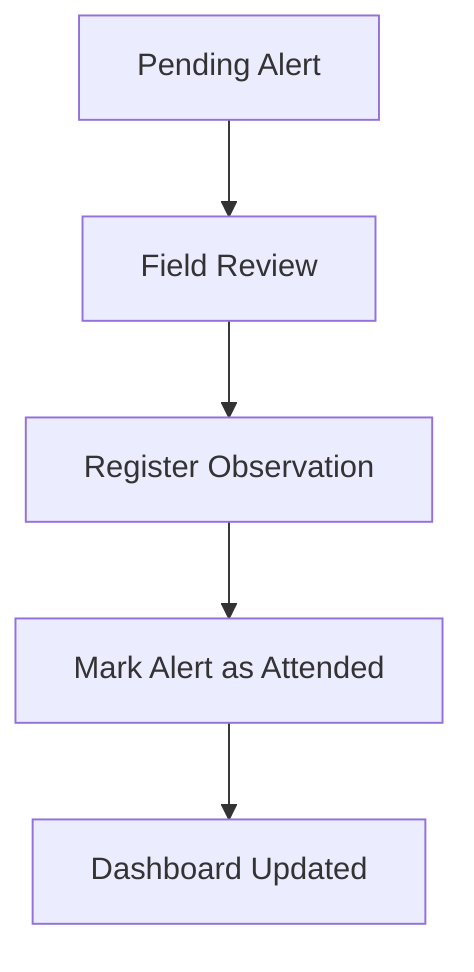

# Inspections

## Purpose

An **Inspection** is the operational field action performed after an alert is generated. In the MVP, inspections are represented mainly through alert status changes and observations.

## Responsibilities

The Inspections domain is responsible for:

- Supporting field response to alerts.
- Capturing human validation through observations.
- Allowing alerts to be marked as attended.
- Preserving operational traceability.

## Conceptual Workflow

## Business Rules

| Rule ID    | Rule                                                              |
| ---------- | ----------------------------------------------------------------- |
| INS-BR-001 | A field operator can inspect an alert.                            |
| INS-BR-002 | An inspection can produce one or more observations.               |
| INS-BR-003 | An alert can be marked as `ATTENDED` after review.                |
| INS-BR-004 | The system should preserve who performed the action and when.     |
| INS-BR-005 | Offline inspection actions must be queued and synchronized later. |

## Related Requirements

| Requirement | Description                                         |
| ----------- | --------------------------------------------------- |
| RU-05       | Field operator consults pending alerts from mobile. |
| RU-06       | Field operator registers observations.              |
| RU-07       | Field operator marks alerts as attended.            |
| RU-08       | Field operator continues working offline.           |
| RF-12       | Modify alert status.                                |
| RF-13       | Register observations.                              |

## Related Use Cases

| Use Case | Description                   |
| -------- | ----------------------------- |
| CU-04    | Register observation.         |
| CU-05    | Synchronize field operations. |

## Impact Analysis

Changes to Inspections may affect:

- Alerts.
- Observations.
- Mobile UI.
- Offline Sync.
- User roles and permissions.

## MVP Behavior

For MVP purposes, inspections are lightweight. The system does not include a full inspection form or veterinary workflow.

## Future Improvements

- Add inspection assignment.
- Add checklist-based inspection forms.
- Add resolution categories.
- Add veterinarian escalation.

---

## References

- `DOC-01_GyrMonitor_V2_Academico`: master requirements, architecture, offline-first strategy, data models, and C4 diagrams.
- `DOC-03_GyrMonitor_Contratos_Backend_V2_Academico`: REST contracts, DTOs, authentication, synchronization, idempotency, and error model.

## Change History

| Version |       Date | Notes                                                                |
| ------- | ---------: | -------------------------------------------------------------------- |
| 0.1     | 2026-06-26 | Initial domain knowledge-base extraction from academic DOCX sources. |
