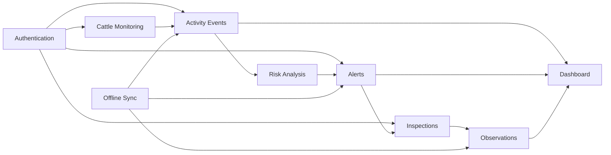

# Module Dependency Map

## Purpose

This document maps the dependencies between GyrMonitor modules from a domain perspective. It helps developers and AI agents understand which areas may be affected when a change is proposed.

## High-Level Dependency Flow



## Dependency Table

| Module            | Depends On                                        | Used By                                       |
| ----------------- | ------------------------------------------------- | --------------------------------------------- |
| Authentication    | User, Role                                        | All protected modules.                        |
| Cattle Monitoring | None                                              | Activity Events, Alerts, Dashboard.           |
| Activity Events   | Cattle Monitoring, Authentication                 | Risk Analysis, Dashboard, Offline Sync.       |
| Risk Analysis     | Activity Events                                   | Alerts, Dashboard.                            |
| Alerts            | Cattle, Activity Events, Risk Analysis            | Inspections, Observations, Dashboard, Mobile. |
| Inspections       | Alerts, Authentication                            | Observations, Dashboard.                      |
| Observations      | Alerts, User                                      | Dashboard, Offline Sync.                      |
| Offline Sync      | Events, Observations, Alerts cache                | Mobile, Desktop, Backend sync endpoints.      |
| Dashboard         | Cattle, Events, Alerts, Observations, Sync status | Web frontend, Researchers, Administrators.    |

## Change Impact Guidance

| Change Area                   | Review These Documents                                                      |
| ----------------------------- | --------------------------------------------------------------------------- |
| Event payload changes         | `activity-events.md`, `risk-analysis.md`, `offline-sync.md`, API contracts. |
| Risk calculation changes      | `risk-analysis.md`, `alerts.md`, dashboard metrics.                         |
| Alert status changes          | `alerts.md`, `inspections.md`, mobile workflows, API contracts.             |
| Observation changes           | `observations.md`, `offline-sync.md`, alert detail views.                   |
| Offline sync behavior changes | `offline-sync.md`, `activity-events.md`, `observations.md`, error model.    |
| Cattle fields change          | `cattle.md`, event registration, dashboard, database model.                 |

## OpenSpec Usage

When creating a future OpenSpec proposal, use this map to identify impacted modules before defining tasks.

Example:

```text
Change: add-alerts
Primary documents:
- 02-domain/alerts.md
- 02-domain/risk-analysis.md
- 02-domain/observations.md
- 02-domain/module-dependency-map.md

Likely impacted implementation areas:
- Backend API
- Mobile alert list
- Dashboard metrics
- Offline sync for observations
```

---

## References

- `DOC-01_GyrMonitor_V2_Academico`: master requirements, architecture, offline-first strategy, data models, and C4 diagrams.
- `DOC-03_GyrMonitor_Contratos_Backend_V2_Academico`: REST contracts, DTOs, authentication, synchronization, idempotency, and error model.

## Change History

| Version |       Date | Notes                                                                |
| ------- | ---------: | -------------------------------------------------------------------- |
| 0.1     | 2026-06-26 | Initial domain knowledge-base extraction from academic DOCX sources. |
