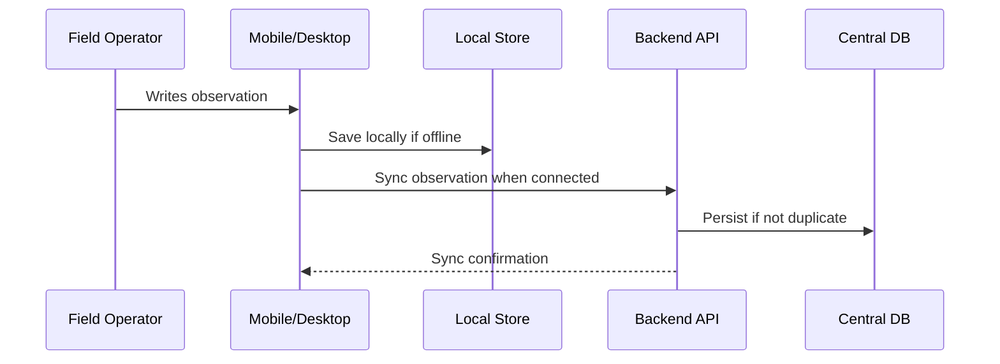

# Observations

## Purpose

An **Observation** documents what a field operator records after reviewing an alert or inspecting a cattle record. Observations provide human context and operational traceability.

## Responsibilities

Observations are responsible for:

- Capturing field operator comments.
- Linking field findings to an alert.
- Preserving the timestamp when the observation was created.
- Preserving the user who created the observation.
- Supporting offline capture and later synchronization.

## Entity Definition

| Field         | Type     | Description                                                    |
| ------------- | -------- | -------------------------------------------------------------- |
| id            | UUID     | Observation identifier.                                        |
| observationId | UUID     | Client-provided idempotency identifier for offline operations. |
| alertId       | UUID     | Related alert.                                                 |
| userId        | UUID     | User who created the observation.                              |
| comment       | string   | Field note.                                                    |
| createdAt     | datetime | Observation creation timestamp.                                |
| clientId      | string   | Client identifier when created offline.                        |

## Business Rules

| Rule ID    | Rule                                                                  |
| ---------- | --------------------------------------------------------------------- |
| OBS-BR-001 | An observation must be linked to an existing alert.                   |
| OBS-BR-002 | An observation must contain a non-empty comment.                      |
| OBS-BR-003 | The system must record who created the observation.                   |
| OBS-BR-004 | Offline observations must preserve their original creation timestamp. |
| OBS-BR-005 | Duplicate observation IDs must not create duplicate backend records.  |

## Related Requirements

| Requirement | Description                                                        |
| ----------- | ------------------------------------------------------------------ |
| RF-13       | Register observations.                                             |
| RF-14       | Consult observations.                                              |
| RF-21       | Synchronize pending observations.                                  |
| RF-23       | Apply idempotency.                                                 |
| RN-08       | Maintain traceability between event, alert, observation, and user. |

## Related Use Cases

| Use Case | Description                  |
| -------- | ---------------------------- |
| CU-04    | Register observation.        |
| CU-05    | Synchronize pending records. |

## Observation Flow

## Impact Analysis

Changes to Observations may affect:

- Alert detail views.
- Mobile offline workflows.
- Sync contracts.
- Dashboard traceability.
- Audit requirements.

## MVP Behavior

The MVP supports textual observations only. Attachments, images, structured inspection forms, and veterinary diagnosis fields are outside the MVP scope.

## Future Improvements

- Add photo evidence.
- Add structured checklist fields.
- Add severity adjustment after inspection.
- Add veterinarian review status.

---

## References

- `DOC-01_GyrMonitor_V2_Academico`: master requirements, architecture, offline-first strategy, data models, and C4 diagrams.
- `DOC-03_GyrMonitor_Contratos_Backend_V2_Academico`: REST contracts, DTOs, authentication, synchronization, idempotency, and error model.

## Change History

| Version |       Date | Notes                                                                |
| ------- | ---------: | -------------------------------------------------------------------- |
| 0.1     | 2026-06-26 | Initial domain knowledge-base extraction from academic DOCX sources. |
