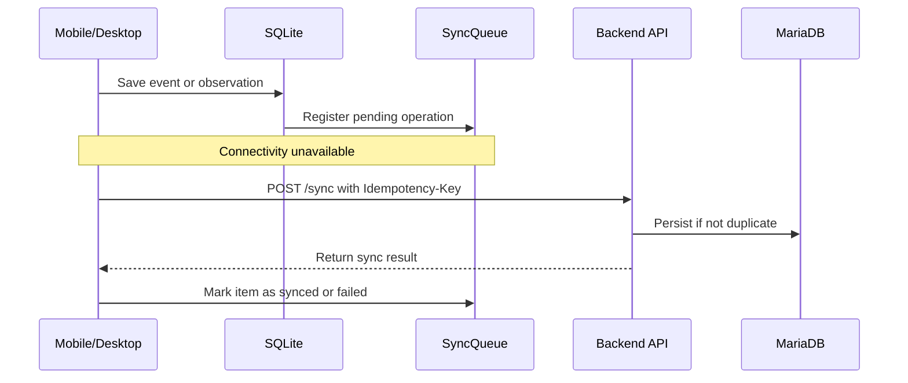

# Offline Synchronization

## Purpose

**Offline Synchronization** allows mobile and desktop clients to continue operating when network connectivity is unavailable. It preserves local operations and synchronizes them with the backend when connectivity returns.

## Responsibilities

Offline Synchronization is responsible for:

- Persisting pending operations locally.
- Maintaining a synchronization queue.
- Retrying failed operations.
- Preserving original capture timestamps.
- Avoiding duplicate backend records through idempotency.
- Recording synchronization outcomes.

## Core Concepts

| Concept            | Description                                              |
| ------------------ | -------------------------------------------------------- |
| Local Store        | SQLite database used by mobile and desktop clients.      |
| SyncQueue          | Local list of operations waiting to be synchronized.     |
| PendingEvent       | Locally captured activity or inactivity event.           |
| PendingObservation | Locally captured observation.                            |
| Idempotency-Key    | Request key used to avoid duplicate processing.          |
| SyncLog            | Backend record of synchronization attempts and outcomes. |

## Local Entities

| Entity             | Purpose                                             |
| ------------------ | --------------------------------------------------- |
| PendingEvent       | Stores events captured offline.                     |
| PendingObservation | Stores observations captured offline.               |
| LocalAlert         | Stores cached alert data needed in the field.       |
| SyncQueue          | Tracks pending operations, retry count, and status. |

## Business Rules

| Rule ID     | Rule                                                                |
| ----------- | ------------------------------------------------------------------- |
| SYNC-BR-001 | Offline operations must be stored locally before sync is attempted. |
| SYNC-BR-002 | Every pending operation must have a sync status.                    |
| SYNC-BR-003 | Synchronization must be retryable.                                  |
| SYNC-BR-004 | Backend sync endpoints must support idempotency.                    |
| SYNC-BR-005 | Successful synchronization marks local queue items as synced.       |
| SYNC-BR-006 | Partial failures must preserve failed items for later retry.        |
| SYNC-BR-007 | Original `capturedAt` or `createdAt` values must be preserved.      |

## Synchronization Flow

## Related Requirements

| Requirement | Description                                             |
| ----------- | ------------------------------------------------------- |
| RF-18       | Persist information locally.                            |
| RF-19       | Maintain sync queue.                                    |
| RF-20       | Synchronize pending events.                             |
| RF-21       | Synchronize pending observations.                       |
| RF-22       | Detect synchronization conflicts.                       |
| RF-23       | Apply idempotency.                                      |
| RN-04       | Operate under intermittent connectivity.                |
| RN-05       | Synchronize offline captured information automatically. |
| RN-06       | Avoid event duplication during retries.                 |

## Related Use Cases

| Use Case | Description                             |
| -------- | --------------------------------------- |
| CU-05    | Synchronize events.                     |
| CU-04    | Register observation offline or online. |

## Impact Analysis

Changes to Offline Sync may affect:

- Mobile client.
- Desktop client.
- Activity Events.
- Observations.
- Alerts cache.
- Backend idempotency.
- Sync API contracts.
- Error handling.

## MVP Behavior

The MVP uses a store-and-forward model. It does not require real-time conflict resolution, distributed transactions, or event-driven infrastructure.

## Future Improvements

- Add background sync workers.
- Add conflict resolution UI.
- Add sync progress indicators.
- Add encrypted local storage.
- Add event batches optimized for external devices.

---

## References

- `DOC-01_GyrMonitor_V2_Academico`: master requirements, architecture, offline-first strategy, data models, and C4 diagrams.
- `DOC-03_GyrMonitor_Contratos_Backend_V2_Academico`: REST contracts, DTOs, authentication, synchronization, idempotency, and error model.

## Change History

| Version |       Date | Notes                                                                |
| ------- | ---------: | -------------------------------------------------------------------- |
| 0.1     | 2026-06-26 | Initial domain knowledge-base extraction from academic DOCX sources. |
