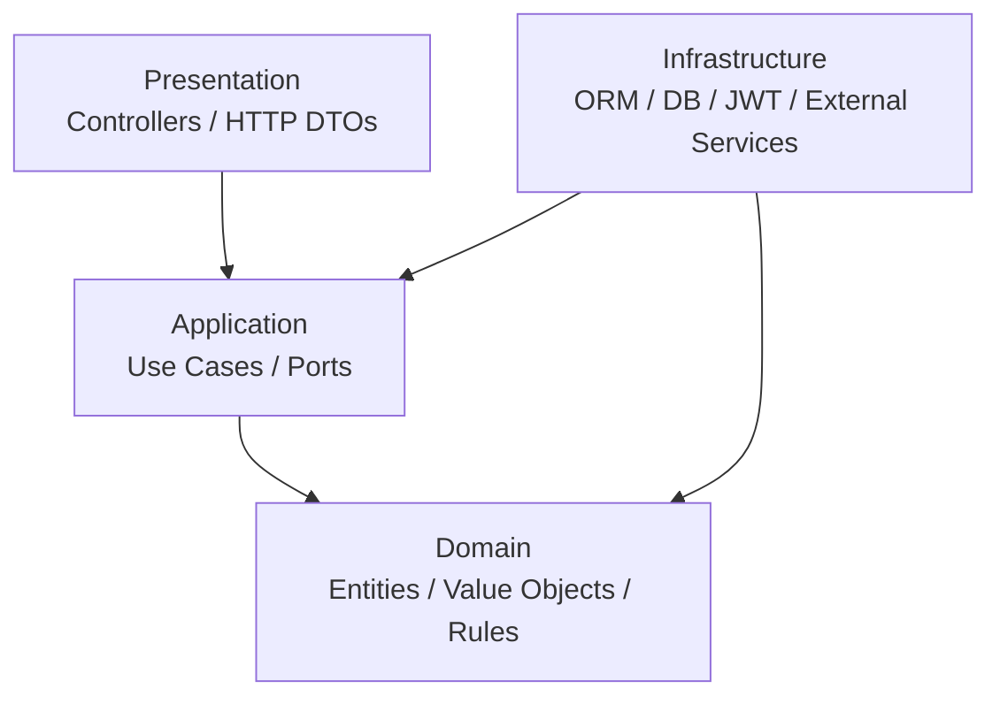

# Clean Architecture

## Purpose

This document explains how GyrMonitor applies Clean Architecture to keep business rules independent from frameworks, databases and transport protocols.

## Layer Model



## Layer Responsibilities

| Layer | Responsibility | Examples |
| --- | --- | --- |
| Domain | Business concepts and invariants. | Cattle, ActivityEvent, Alert, RiskScore. |
| Application | Use cases and ports. | RegisterActivityEventUseCase, SyncEventsUseCase. |
| Presentation | HTTP controllers and DTO mapping. | EventsController, AlertsController. |
| Infrastructure | Database, ORM, JWT and concrete adapters. | MariaDB repositories, JWT service. |

## Dependency Rule

Dependencies point inward toward the domain.

- Domain must not import NestJS, Prisma, MariaDB, HTTP, JWT or React concepts.
- Application may depend on domain and abstract ports.
- Infrastructure implements ports.
- Presentation adapts HTTP requests into application use cases.

## Use Case Examples

| Use Case | Domain Concepts | Infrastructure Dependencies |
| --- | --- | --- |
| RegisterActivityEventUseCase | ActivityEvent, RiskScore, Alert | ActivityEventRepository, AlertRepository. |
| AttendAlertUseCase | Alert, AlertStatus | AlertRepository. |
| AddAlertObservationUseCase | Observation, Alert | ObservationRepository, UserContext. |
| SyncEventsUseCase | ActivityEvent, IdempotencyKey | SyncLogRepository, ActivityEventRepository. |

## Recommended Backend Module Structure

```text
src/
  activity-events/
    domain/
    application/
    infrastructure/
    presentation/
  alerts/
    domain/
    application/
    infrastructure/
    presentation/
  shared/
```

## Benefits

- Easier unit testing of business rules.
- Lower coupling to NestJS and database details.
- Clearer mapping from requirements to implementation.
- Safer future evolution toward queues, time-series storage or additional approved event producers.

## Frontend Clean Architecture Layering

The frontend applies the same layer model per feature (`frontend/src/features/<feature>/`), documented in detail in `frontend/src/features/README.md`:

```text
features/<feature>/
  domain/          Client-safe feature types and UX validation. No React, router, TanStack Query, browser APIs, or HTTP clients.
  application/      TanStack Query hooks and mutation/query orchestration.
  infrastructure/   HTTP API adapters and browser/storage adapters.
  presentation/     Pages and view composition; consumes application hooks and domain types.
```

`auth`, `user-management`, `dashboard`, `cattle`, and `alerts` are fully layered; `events` and `metrics` are placeholder/deferred (cattle detail shows read-only event history instead of a dedicated events UI). Route adapters live in `app/router` and import presentation entry points from feature barrels, keeping the dependency direction the same as the backend: presentation depends on application, application depends on domain, infrastructure implements ports consumed by application.

## Mobile/Desktop Clean Architecture Layering

The `.NET MAUI` clients apply the same layer model per feature, adapted to MVVM (documented in detail in `06-engineering/mobile/maui-architecture.md`, `06-engineering/desktop/maui-desktop.md`, and `openspec/specs/maui-client-architecture/spec.md`):

```text
Features/<feature>/           (inside GyrMonitor.Mobile.Core or GyrMonitor.Desktop.Core)
  Domain/          Client-local entities and validation used for offline persistence. No MAUI, CommunityToolkit.Mvvm, or HttpClient types; may carry sqlite-net-pcl [Table]/[PrimaryKey] mapping attributes as persistence shape, but no SQLite connection/query types.
  Application/       Orchestrator/use-case classes the ViewModel calls; depend on Domain and abstract ports (I*Repository, I*Api).
  Infrastructure/     SQLite repositories, API clients, DTOs, and mapping; implement the ports Application depends on.
  Presentation/       The ViewModel (Core project) plus the XAML page/code-behind in the UI head project (GyrMonitor.Mobile/GyrMonitor.Desktop).
```

`desktop/EventSimulator`, `mobile/Observations`, `mobile/Sync`, `desktop/Sync`, `mobile/Alerts`, and the shared `Sync` primitives in `shared/GyrMonitor.Client.Core` are layered; `desktop/Cattle`, `desktop/Dashboard`, `desktop/Alerts`, and `Authentication` (mobile/desktop) stay intentionally flat as single-call, read-only, or single-orchestration-step features. Dependencies point the same direction as the backend and frontend: Presentation depends on Application, Application depends on Domain and ports, Infrastructure implements those ports. See `08-decisions/ADR-017-maui-client-clean-architecture.md` for the context, alternatives considered, and the accepted trade-offs (more files per user action, more indirect test setup, no user-facing payoff at the time of adoption).
