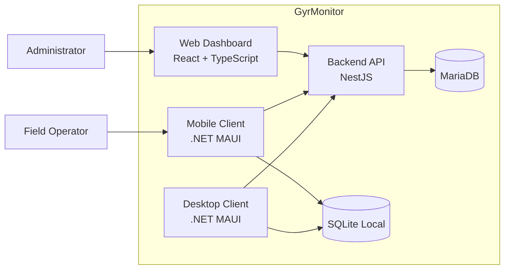

# Container Architecture

## Purpose

This document describes the deployable and runtime containers of GyrMonitor.

## Containers

| Container | Technology | Responsibility |
| --- | --- | --- |
| Web Dashboard | React + TypeScript | Dashboard, trends, cattle history, alert review. |
| Mobile Client | .NET MAUI | Field alert consultation and offline observations. |
| Desktop Client | .NET MAUI | Desktop access and event simulation for MVP. |
| Backend API | NestJS + TypeScript | Business rules, use cases, REST API, sync processing. |
| Central Database | MariaDB | Source of truth for synchronized system data. |
| Local Database | SQLite | Offline persistence for mobile and desktop clients. |

## Container Diagram

## Backend as Business Authority

The backend owns:

- Risk score calculation.
- Alert generation.
- Alert status validation.
- Idempotency enforcement.
- Security and authorization.
- Persistence in the central database.

Clients may validate input for usability, but they must not own critical business decisions.

## Client Responsibilities

### Web Dashboard

- Display global metrics.
- Display active alerts.
- Display risk ranking.
- Display trends.
- Consume REST API via a typed HTTP client.

### Mobile Client

- Cache alerts for field review.
- Register observations offline.
- Maintain local Sync Queue.
- Synchronize pending records when connectivity returns.

### Desktop Client

- Support monitoring and simulation workflows.
- Persist local pending events if offline.
- Support testing of event generation before real external event-source integration.

## Container Dependency Rule

Clients depend on API contracts. The backend must not depend on client-specific details.
