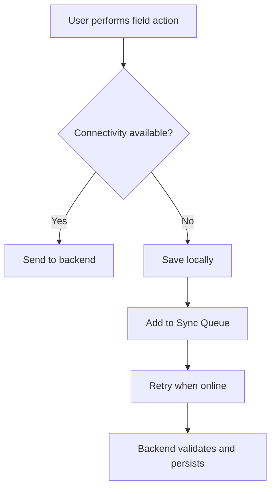

# Failure Modes

## Purpose

This document identifies expected failure scenarios and mitigation strategies.

## Failure Mode Register

| ID | Failure Mode | Impact | Mitigation |
| --- | --- | --- | --- |
| FM-001 | No internet connectivity | Field data cannot reach backend immediately. | SQLite + Sync Queue. |
| FM-002 | Duplicate sync request | Duplicate events or observations. | Idempotency-Key + eventId/observationId. |
| FM-003 | Backend unavailable | Clients cannot sync or load fresh data. | Local queue, retries, clear user state. |
| FM-004 | Invalid cattle reference | Event cannot be associated correctly. | Backend validation and per-item sync results. |
| FM-005 | Dashboard query slow | Poor monitoring experience. | Indexes, pagination, future caching. |
| FM-006 | Expired JWT | User cannot access protected endpoints. | Token expiration handling and login redirect. |
| FM-007 | Local sync queue corruption | Pending data may be lost. | SQLite constraints, logs, export/debug support in future. |
| FM-008 | Incorrect risk threshold | False positive or false negative alerts. | Configurable thresholds and tests. |
| FM-009 | Event source uncertainty | Alerts may be inaccurate. | Confidence field and human review workflow. |

## Connectivity Failure Flow

## Error Handling Principles

- Failures must be visible to the user when action is required.
- Technical details must be logged but not exposed unnecessarily.
- Retryable failures must not create duplicate records.
- Critical failures should preserve local data whenever possible.

## Future Improvements

- Dead-letter queue for repeated sync failures.
- Admin sync diagnostics dashboard.
- Client-side export of pending queue for support.
- Alerting on backend error rates.
