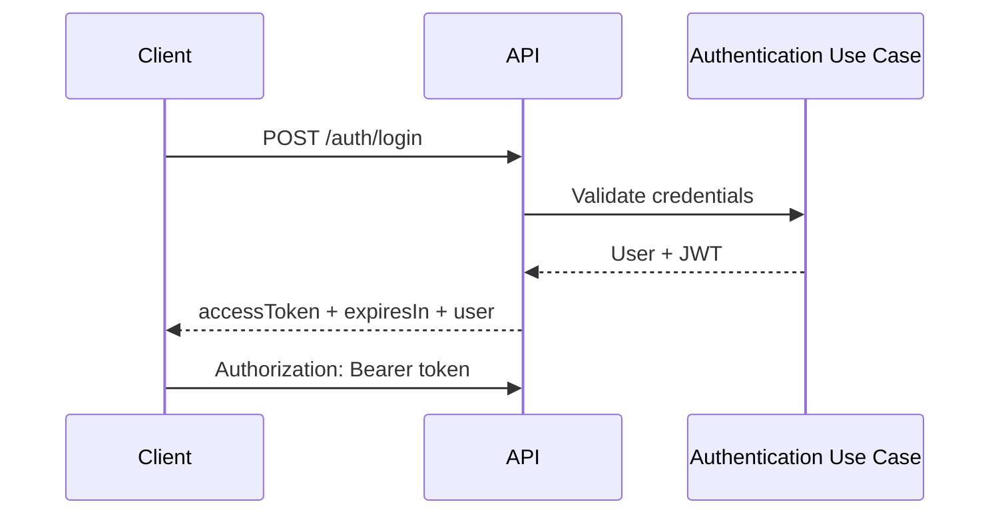

# Security Architecture

## Purpose

This document describes the security architecture for authentication, authorization and safe API consumption.

## Security Model

GyrMonitor uses JWT-based authentication for protected API endpoints.

## Roles

| Role | Permissions |
| --- | --- |
| ADMIN | Manage cattle, dashboard, events, alerts and observations. |
| FIELD_OPERATOR | Consult alerts, register observations, attend alerts and sync field data. |
| RESEARCHER | Consult dashboard, trends and history. |
| SYSTEM_GENERATOR | Register activity and inactivity events. |

## Endpoint Protection

| Endpoint | Protection |
| --- | --- |
| `POST /auth/login` | Public. |
| `GET /health` | Public or protected depending on deployment. |
| All other endpoints | JWT required. |

## Authentication Flow

## Authorization Principles

- API endpoints must validate role permissions.
- Clients may hide UI actions based on role, but backend authorization is authoritative.
- System-generated events should use a role or credential model appropriate for automated sources.

## Transport Security

Production communication should use HTTPS.

## Token Handling

The frontend and clients must:

- include JWT using `Authorization: Bearer <token>`;
- handle expired tokens gracefully;
- clear session state on logout;
- avoid storing credentials.

## Security Risks

| Risk | Mitigation |
| --- | --- |
| Expired or invalid token | 401 handling and re-authentication. |
| Unauthorized role action | Backend role guards. |
| Sensitive data exposure | Minimal logging and controlled DTOs. |
| Token leakage | Secure storage strategy per client platform. |
| Duplicate critical requests | Idempotency for sync and critical POST operations. |

## Future Improvements

- Refresh token flow.
- Client registration for trusted event producers.
- Audit logs for administrative actions.
- Fine-grained permissions.
