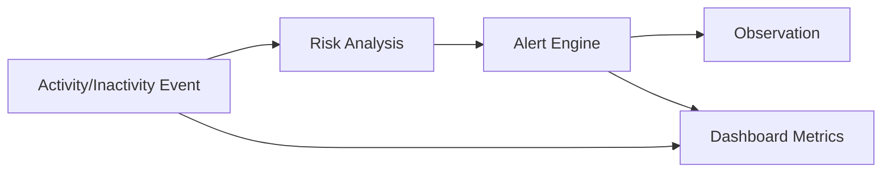

# System Design

## Purpose

This document captures system-level assumptions, constraints and engineering considerations.

## MVP Capacity Assumptions

| Assumption | Value |
| --- | --- |
| Cattle records | 100 |
| Events per cattle | 1 per minute |
| Daily events | 144,000 |
| Monthly events | 4,320,000 |
| Concurrent users | Low to medium |

## System Characteristics

| Characteristic | MVP Target |
| --- | --- |
| Availability | Clients continue field-critical work offline. |
| Consistency | Eventual consistency for offline clients. |
| Performance | Dashboard typical response under 3 seconds. |
| Security | JWT-based API protection. |
| Observability | Sync and API errors must be traceable. |
| Maintainability | Domain-first modular structure. |

## Latency Budget

| Operation | Target |
| --- | --- |
| Dashboard load | < 3 seconds typical case. |
| Alert list | < 2 seconds typical case. |
| Local offline save | Near immediate. |
| Sync batch | Depends on batch size and connectivity. |

## Data Flow

## Read and Write Patterns

| Pattern | Description |
| --- | --- |
| Event ingestion | Frequent writes from generator or simulator. |
| Alert consultation | Repeated reads by field and dashboard users. |
| Observation writing | Human-generated, lower frequency. |
| Dashboard aggregation | Read-heavy and likely to require caching later. |

## Design Constraints

- Rural connectivity is unreliable.
- The MVP must remain simple enough for academic implementation.
- Additional approved event producers may increase event volume.
- Business rules must be testable independently of API controllers.

## Recommended Engineering Priorities

1. Correctness of event, risk and alert flow.
2. Idempotent synchronization.
3. Traceability.
4. Dashboard performance.
5. Testability of business rules.
