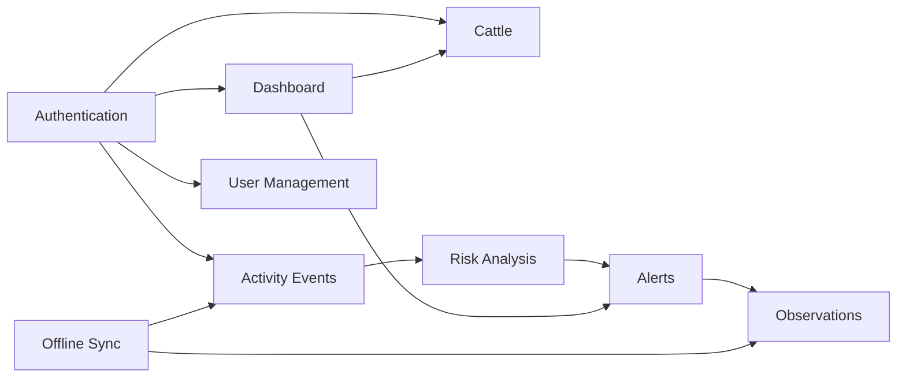

# API & Contracts Knowledge Base

## Purpose

This section documents the REST API contracts used by GyrMonitor clients: web, mobile, desktop and future external event-source modules.

The API is the integration boundary between client applications and backend use cases. It must remain stable, versioned, secure and traceable to requirements, use cases and domain entities.

## Documentation Map

| Document             | Purpose                                                                     |
| -------------------- | --------------------------------------------------------------------------- |
| `overview.md`        | High-level API architecture and contract principles.                        |
| `conventions.md`     | Versioning, naming, headers, response envelopes and pagination conventions. |
| `authentication.md`  | Login, JWT, roles and protected resources.                                  |
| `dashboard.md`       | Dashboard metrics endpoint.                                                 |
| `user-management.md` | ADMIN-only user create/list/disable/reactivate/reset-password contracts.   |
| `cattle.md`          | Cattle listing and cattle history contracts.                                |
| `activity-events.md` | Activity/inactivity event registration and query contracts.                 |
| `alerts.md`          | Alert query, detail and status update contracts.                            |
| `observations.md`    | Inspection observation contracts.                                           |
| `offline-sync.md`    | Store-and-forward synchronization contracts.                                |
| `error-model.md`     | Standard error model and error code catalog.                                |
| `dto-catalog.md`     | Central DTO catalog used by API consumers.                                  |
| `security.md`        | API security rules, authentication and authorization expectations.          |
| `http-examples.md`   | Copy-ready HTTP examples for local testing.                                 |

## API Modules

## Contract Principles

- REST over HTTP for MVP simplicity and broad client compatibility.
- JSON request and response bodies.
- Route-based versioning using `/api/v1`.
- JWT Bearer authentication for all protected resources.
- Stable DTOs decoupled from internal domain entities.
- Idempotency for operations that can be retried, especially synchronization.
- Consistent success and error envelopes.
- Traceability from endpoint to requirement, use case and domain module.

## Base URL

| Environment            | Base URL                                    |
| ---------------------- | ------------------------------------------- |
| Local                  | `http://localhost:3000/api/v1`              |
| Production placeholder | `https://api.gyrmonitor.example.com/api/v1` |

## Change History

| Version | Change                                          |
| ------- | ----------------------------------------------- |
| 0.5.0   | Created modular API and contract documentation. |
