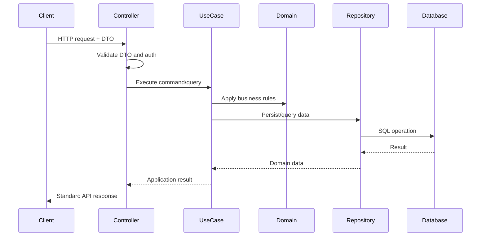

# API Overview

## Purpose

This document defines the API design approach for GyrMonitor. The API exposes backend use cases to web, mobile, desktop and future external event-source clients.

## Scope

The MVP API covers:

- Authentication.
- Dashboard metrics.
- Cattle monitoring.
- Activity and inactivity events.
- Alert management.
- Observations and inspections.
- Offline synchronization.
- Health and operational status.

## Architectural Role

The API is an adapter layer. It receives HTTP requests, validates DTOs, enforces authentication/authorization and delegates business execution to application use cases.

Controllers must not contain domain rules. Risk calculation, alert generation, idempotency and synchronization decisions belong to application/domain services.

## API Flow



## Versioning

The API is versioned by route:

```http
/api/v1
```

Breaking changes must create a new version rather than silently changing existing contracts.

## API Consumers

| Consumer | Purpose |
| --- | --- |
| Web Dashboard | Read metrics, alerts, rankings and trends. |
| Mobile App | Query and attend alerts, register observations, sync offline data. |
| Desktop App | Dashboard, simulator, monitoring and offline-capable workflows. |
| System Generator | Send activity/inactivity events from simulator, desktop client or controlled test data. |

## Non-Goals

The API does not expose:

- Production ML inference.
- Raw video uploads.
- IoT sensor ingestion.
- Automatic veterinary diagnosis.
- Public anonymous access.

## References

- `05-api/conventions.md`
- `05-api/error-model.md`
- `05-api/security.md`
- `04-architecture/clean-architecture.md`
