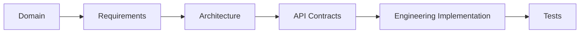

# Engineering Knowledge Base

This section defines how GyrMonitor should be implemented across backend, frontend, database, mobile and desktop clients.

The engineering documentation is intentionally separated from domain and requirements documentation. Domain documents explain what the system means. Engineering documents explain how the system should be built.

## Scope

- Backend implementation with NestJS and Clean Architecture.
- Frontend implementation with React, TypeScript and feature-based organization.
- Central persistence with MariaDB.
- Local persistence with SQLite for mobile and desktop.
- Offline synchronization client behavior.
- Testing expectations for each layer.
- Initial deployment and seed data guidance.

## Navigation

| Area | Document |
| --- | --- |
| Backend | [backend/overview.md](backend/overview.md) |
| Frontend | [frontend/overview.md](frontend/overview.md) |
| Database | [database/overview.md](database/overview.md) |
| Mobile | [mobile/overview.md](mobile/overview.md) |
| Desktop | [desktop/overview.md](desktop/overview.md) |

## Engineering Principle

Implementation must follow the documentation flow:

Code must not become the only source of truth. When implementation changes a business rule, API contract or architectural decision, the relevant documentation must be updated.
