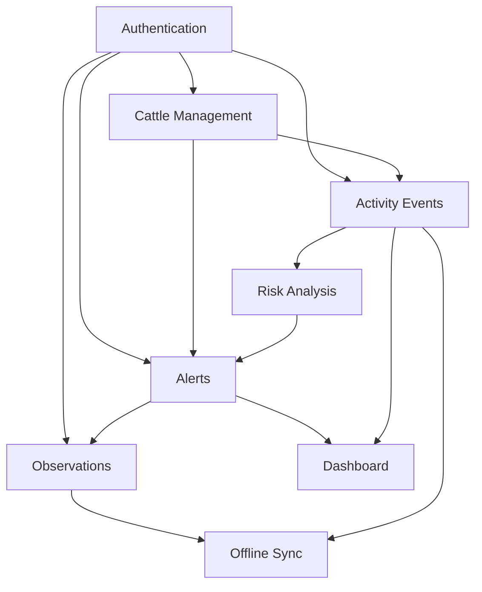

# Dependency Matrix

## Practical Reading

- Changes to Activity Events can affect Risk Analysis, Alerts, Dashboard and Offline Sync.
- Changes to Alerts can affect Observations, Dashboard and Mobile/Desktop workflows.
- Changes to Authentication can affect every protected module.
